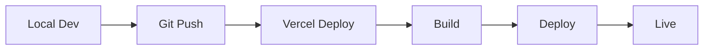

# 📁 โครงสร้างโปรเจค i-Clean API (Vercel)

## โครงสร้างไฟล์ที่ต้องมี

```
i-clean-api/
│
├── api/                          # Vercel Serverless Functions
│   └── index.js                  # Main API endpoint
│
├── public/                       # Static files (optional)
│   └── test-api.html            # API Tester page
│
├── vercel.json                   # Vercel configuration
├── package.json                  # Dependencies
├── .gitignore                   # Git ignore rules
├── .env.example                 # Environment variables template
│
├── README.md                     # Project documentation
├── VERCEL-DEPLOY.md             # Deployment guide
├── PROJECT-STRUCTURE.md         # This file
│
└── test-api.sh                  # CLI test script (optional)
```

## 📝 รายละเอียดแต่ละไฟล์

### `/api/index.js` ⭐ (สำคัญที่สุด)
```javascript
// Main serverless function
// - Express app
// - API endpoints
// - Email sending
// - Error handling
```

**Endpoints:**
- `GET /api/health` - Health check
- `POST /api/wholesale-inquiry` - รับข้อมูลตัวแทน
- `POST /api/newsletter-subscribe` - สมัครรับข่าวสาร

### `/vercel.json` ⭐
```json
{
  "version": 2,
  "builds": [{
    "src": "api/index.js",
    "use": "@vercel/node"
  }],
  "routes": [{
    "src": "/(.*)",
    "dest": "/api/index.js"
  }]
}
```

**Purpose:**
- กำหนดวิธี build project
- ตั้งค่า routing
- กำหนด environment settings

### `/package.json`
```json
{
  "dependencies": {
    "express": "^4.18.2",
    "cors": "^2.8.5",
    "nodemailer": "^6.9.7"
  }
}
```

**Dependencies ที่จำเป็น:**
- `express` - Web framework
- `cors` - CORS middleware
- `nodemailer` - Email sending

### `.gitignore`
```
node_modules/
.env
.vercel
```

**Files to ignore:**
- `node_modules/` - Dependencies
- `.env` - Sensitive data
- `.vercel/` - Vercel build files

## 🎯 Environment Variables ที่ต้องตั้ง

```bash
EMAIL_USER=your-email@gmail.com
EMAIL_PASS=your-app-password
SMTP_HOST=smtp.gmail.com
SMTP_PORT=587
ADMIN_EMAIL=info@i-clean.co.th
```

**ตั้งค่าผ่าน Vercel Dashboard:**
1. Project Settings > Environment Variables
2. เพิ่มแต่ละ variable
3. เลือก Environment: Production, Preview, Development

## 🚀 Deployment Flow



### Step by Step:

1. **Local Development**
   ```bash
   npm install
   vercel dev
   ```

2. **Git Commit**
   ```bash
   git add .
   git commit -m "Update API"
   git push origin main
   ```

3. **Auto Deploy** (ถ้า connect กับ Git)
   - Vercel auto deploy เมื่อ push
   - Preview deployment สำหรับ PR
   - Production deployment สำหรับ main branch

4. **Manual Deploy**
   ```bash
   vercel --prod
   ```

## 📊 Vercel Dashboard

### Tabs ที่สำคัญ:

1. **Overview**
   - Deployment status
   - Performance metrics
   - Recent deployments

2. **Deployments**
   - History ของทุก deployment
   - Preview links
   - Logs

3. **Settings**
   - Environment Variables
   - Domains
   - Git Integration
   - Build & Development Settings

4. **Analytics** (ถ้าเปิดใช้)
   - Page views
   - Request count
   - Performance data

## 🔧 Local Development

### Setup:
```bash
# Clone project
git clone <repository-url>
cd i-clean-api

# Install dependencies
npm install

# Copy environment variables
cp .env.example .env
# แก้ไข .env ใส่ข้อมูลจริง

# Run locally with Vercel CLI
vercel dev

# หรือใช้ Node.js ธรรมดา
node api/index.js
```

### Test locally:
```bash
# Health check
curl http://localhost:3000/api/health

# หรือเปิดเบราว์เซอร์
open http://localhost:3000/test-api.html
```

## 🧪 Testing

### 1. ใช้ test-api.html
```bash
# เปิดไฟล์ใน browser
open public/test-api.html

# หรือ serve ด้วย Python
python -m http.server 8000
# เข้า http://localhost:8000/test-api.html
```

### 2. ใช้ test-api.sh
```bash
chmod +x test-api.sh
./test-api.sh https://i-clean-api.vercel.app
```

### 3. ใช้ cURL
```bash
# Health
curl https://i-clean-api.vercel.app/api/health

# Wholesale
curl -X POST https://i-clean-api.vercel.app/api/wholesale-inquiry \
  -H "Content-Type: application/json" \
  -d '{"fullname":"ทดสอบ","email":"test@example.com","phone":"081-234-5678","business_type":"online"}'

# Newsletter
curl -X POST https://i-clean-api.vercel.app/api/newsletter-subscribe \
  -H "Content-Type: application/json" \
  -d '{"email":"test@example.com"}'
```

### 4. ใช้ Postman
- Import `i-Clean-API.postman_collection.json`
- Set base_url variable
- Run collection

## 📈 Monitoring

### Vercel Logs:
```bash
# Real-time logs
vercel logs --follow

# Specific deployment
vercel logs <deployment-url>

# Last 100 lines
vercel logs -n 100
```

### Dashboard Monitoring:
1. เข้า Vercel Dashboard
2. เลือก Project
3. ดู Deployment logs
4. ตรวจสอบ Analytics

## 🐛 Common Issues

### Issue 1: Email ไม่ส่ง
**Check:**
- Environment variables ตั้งค่าถูกต้องหรือไม่
- Gmail App Password ถูกต้องหรือไม่
- ดู Vercel logs มี error อะไร

### Issue 2: CORS Error
**Fix:**
```javascript
// ใน api/index.js
app.use(cors({
    origin: ['https://i-clean.co.th'],
    credentials: true
}));
```

### Issue 3: Function Timeout
**Cause:** Function รันเกิน 10 วินาที (Free plan)
**Fix:**
- Optimize code
- หรือ upgrade เป็น Pro plan

### Issue 4: Build Failed
**Check:**
- `package.json` ถูกต้องหรือไม่
- Dependencies ครบหรือไม่
- Syntax error ใน code

## 💡 Best Practices

### 1. Security
```javascript
// ✅ DO: ใช้ Environment Variables
const password = process.env.EMAIL_PASS;

// ❌ DON'T: Hardcode secrets
const password = "mypassword123";
```

### 2. Error Handling
```javascript
// ✅ DO: Handle errors properly
try {
    await sendEmail(...);
} catch (error) {
    console.error('Email error:', error);
    return res.status(500).json({...});
}
```

### 3. Validation
```javascript
// ✅ DO: Validate input
if (!email || !emailRegex.test(email)) {
    return res.status(400).json({...});
}
```

### 4. Logging
```javascript
// ✅ DO: Log important events
console.log('New inquiry:', inquiry.id);
console.error('Error:', error);
```

## 📚 Resources

- [Vercel Documentation](https://vercel.com/docs)
- [Express.js Guide](https://expressjs.com/)
- [Nodemailer Docs](https://nodemailer.com/)
- [Node.js Best Practices](https://github.com/goldbergyoni/nodebestpractices)

## 🆘 Need Help?

1. **Vercel Community**
   - https://github.com/vercel/vercel/discussions

2. **i-Clean Support**
   - Email: info@i-clean.co.th
   - Line: @iclean.th

3. **Documentation**
   - README.md
   - VERCEL-DEPLOY.md
   - QUICK-START.md

---

**Made with 💚 by i-Clean Team**